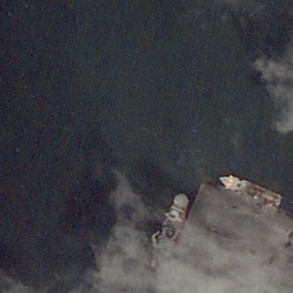

# Introduction
Tool to split a large image into any sub-images.
# How to Use
### 1. Type the command.
```
$ python image_split.py --image_folder [your images folder] --save [the folder to save subimages]
```
```--image_folder```: your images folder  
```--save```: the folder to save subimages  
```--width```: subimage width  
```--height```: subimage height
### 2. Left-click on the desired location in the center of your subimage.

The sub-images will be named as [SourceImageName_centerY_centerX]
<table>
  <tr>
    <td>
      
    </td>
    <td>
      
    </td>
    <td>
      
    </td>
  </tr>
</table>
